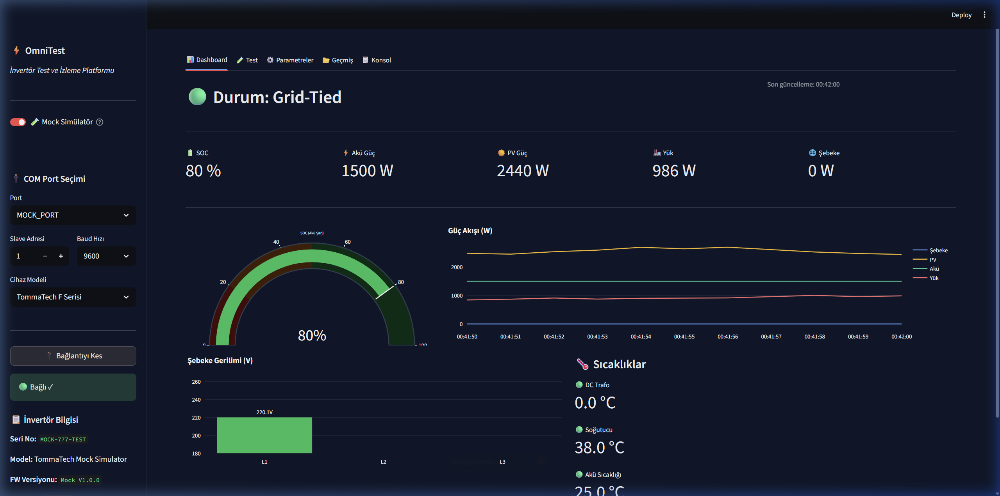
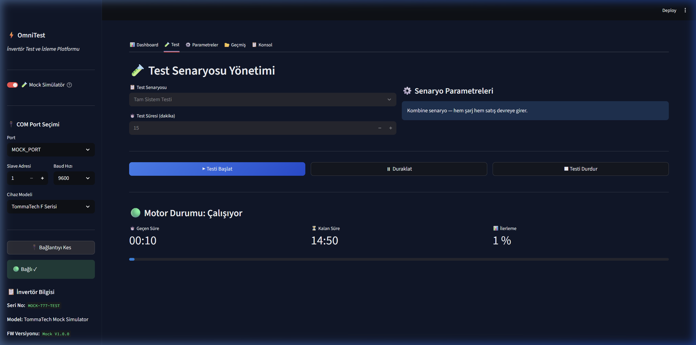
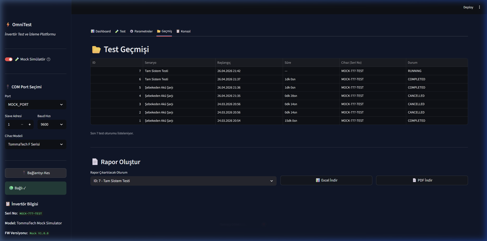
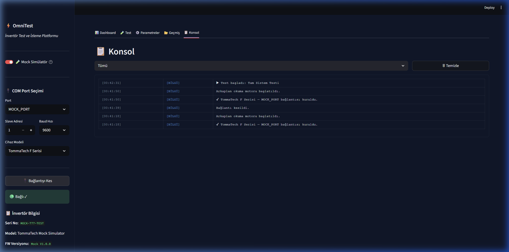

<div align="center">
  
  <h1>⚡ OmniTest: Endüstriyel İnverter Test ve Analiz İstasyonu</h1>
  <p><i>Gerçek Zamanlı Veri Toplama, Otonom Test Senaryoları ve Otomatik Raporlama Sistemi</i></p>
</div>

---

## 1. Yönetici Özeti (Executive Summary)

**OmniTest (Inverter Tester)**, endüstriyel tip enerji invertörlerinin (ör. Deye, vb.) performanslarını gerçek zamanlı olarak izlemek, çeşitli test senaryolarını canlı veriler üzerinden uygulamak ve sonuçları kurumsal standartlarda raporlamak (PDF/Excel) amacıyla tasarlanmış yüksek performanslı bir izleme ve analiz sistemidir. 

Proje, donanım (Modbus RTU/TCP) ile uygulama katmanı (Python) arasında köprü kurarak, enerji sistemlerinin devreye alınması ve periyodik kalite kontrol testleri sırasındaki manuel eforu sıfıra indirmeyi; insan kaynaklı hataları önleyerek veri odaklı (data-driven) içgörüler sunmayı hedefler.

## 2. Sektörel Değer ve Öne Çıkan Özellikler

Bu sistem; enerji, yenilenebilir enerji teknolojileri ve endüstriyel otomasyon sektörlerindeki **Ar-Ge, Kalite Güvence (QA) ve Saha Mühendisliği** ekipleri için tasarlanmış kurumsal bir çözümdür.

*   🌐 **Gerçek Zamanlı Donanım Haberleşmesi:** Canlı ve gerçek sensör verilerini, yüksek hassasiyetle anlık olarak Modbus protokolü üzerinden doğrudan donanımdan okur ve yorumlar.
*   📊 **Dinamik Veri Analizi ve Görselleştirme:** Voltaj, akım, güç, SOC (State of Charge) ve sıcaklık parametreleri gibi kritik verileri, interaktif ve gecikmesiz grafiklere dönüştürerek anomali tespitini kolaylaştırır.
*   🤖 **Otonom Test Senaryoları:** Akü şarj/deşarj, şebeke yük testleri ve off-grid test senaryolarını katı kurallara (State Machine) dayalı olarak otonom yürütür.
*   📄 **Kurumsal Düzeyde Raporlama:** Regülasyonlara ve endüstriyel kalite standartlarına uygun, detaylı cihaz değerlerini, hata (fault) kayıtlarını ve enerji sayaçlarını içeren, tek tıkla otomatik PDF/Excel raporları üretir.
*   🛡️ **Sistem Kararlılığı ve Hata Yönetimi:** Bağlantı kopmaları veya CRC okuma hatalarına karşı kendi kendini toparlayabilen (self-healing), UI thread'i dondurmayan asenkron anketleme (polling) mimarisi içerir.

## 3. Kullanılan Teknolojiler (Tech Stack)

Proje mimarisi, yüksek erişilebilirlik, ölçeklenebilirlik ve veri bütünlüğü ilkeleri gözetilerek modern yazılım bileşenleriyle tasarlanmıştır:

| Kategori | Teknoloji / Araç | Açıklama / Kullanım Amacı |
| :--- | :--- | :--- |
| **Arayüz (Frontend)** | `Streamlit`, CSS3 | Hızlı prototipleme, veri görselleştirme ve interaktif donanım kontrol paneli. |
| **Arka Plan (Backend)** | `Python 3.10+` | Çekirdek sistem mantığı, iş akışı yönetim motoru. |
| **Donanım İletişimi** | `pymodbus`, `pyserial` | İnvertör cihazları ile Modbus RTU üzerinden endüstriyel standartta haberleşme. |
| **Veritabanı (DB)** | `SQLite`, `SQLAlchemy (ORM)` | Telemetri verileri ve hata günlüklerinin güvenli formatta, ACID uyumlu depolanması. |
| **Veri & Konfigürasyon**| `Pydantic`, `YAML` | Güçlü tip koruması (Type Hinting), veri doğrulama (validation) ve ayar yönetimi. |
| **Test & Kalite** | `Pytest`, `Mocking` | Temel veri çevirme (Parsing) sınıfları için %100, genel sistem için %80+ otomatik test kapsamı (coverage). |

## 4. Sistem Mimarisi ve İş Akışı

Platform; arayüz ile donanım haberleşmesinin tamamen izole edildiği bir "Producer-Consumer" yapısı etrafında şekillenmiştir.

1.  **Bağlantı ve Başlatma:** Kullanıcı sisteme girdiğinde COM portları `serial.tools` modülü ile dinamik taranarak listelenir. Belirlenen baud hızı ve slave ID parametreleriyle invertör donanımına güvenli bağlantı (Handshake) sağlanır.
2.  **Multithreaded Veri Akışı (Polling):** Arka planda çalışan izole bir *Worker Thread*, belirlenmiş frekans aralıklarında (Örn: 1000ms), ana UI'yi bloklamadan donanım registerlarını okumaya başlar.
3.  **Ham Veri İşleme (Data Pasing Katmanı):** Donanımdan gelen ham (Hex) 16-bit / 32-bit (Low Word / High Word) Modbus dizilimleri; endian standartlarına göre birleştirilir, ikiye tümler (two's complement) mantığıyla sign ve offset değerleri ayıklanır ve konfigürasyondaki dinamik çarpanlarla anlamlı mühendislik birimlerine (V, A, W, °C) çevrilir.
4.  **Uyarı ve Durum Yönetimi:** Elde edilen anlamlı veriler, aktif operasyon senaryosunun (Örn: Şebekeden Akü Şarjı, Tam Sistem Testi vb.) güvenli limit parametreleriyle anlık karşılaştırılır. Herhangi bir `Fault Code` çözümlendiğinde derhal UI tarafına thread-safe mekanizmalar üzerinden iletilir.
5.  **Kalıcı Depolama ve Raporlama:** Tüm okumalar ve durum değişimleri, `session_scope` context manager'ı eşliğinde anlık olarak SQLite veritabanına loglanır. Test bittikten sonra veriler derlenir ve PDF formatında yönetici onaylı bir kalite güvence raporu statüsünde dışa aktarılır.

## 5. Kritik Mühendislik Noktaları

Sistemi geliştirirken çözülen temel mimari problemler ve best-practice yaklaşımlar The Twelve-Factor App metodolojisi temelinde şekillenmiştir:

> [!CAUTION]
> **Modbus Register Optimizasyonu (Parçalı Okuma):**
> Modbus RTU protokol limitleri gereği, tek seferde maksimum 125 register okunabilir. Donanım veriyolunu aşırı yüklememek ve sorgu süresini optimize etmek adına **Adjacent Register Grouping** (bitişik verileri gruplayarak tek seferde okuma) algoritması geliştirildi.

> [!TIP]
> **Thread-Safety ve Crash-Free Mimari:**
> Endüstriyel alanlarda yaygın olan *SerialCommunicationError*, *TimeoutError* ve *CRC hataları* UI katmanını çökertmez. Alt katmanda oluşan her exception yakalanır, sessizlikten (swallowing) kaçınılarak yapısal loğa (structured logging) kaydedilir. Sistem kopma anında kendini uykuya alır (Exponential Backoff) ve bağlantı düzeldiğinde test sürecine kendi kendine (otonom) devam eder.

> [!IMPORTANT]
> **Donanım Bit Düzeyi İşlemleri (Bitwise Operations):**
> Özellikle 32-bit verilerin (Örn: Toplam Üretim/Tüketim sayacı) hesaplanmasında, donanımdan gelen Low Word ve High Word yapıları birleştirilmeden kesinlikle veri manipülasyonu / kat sayı çarpımı işlemi yapılmaz. Veriler önce `(high_word << 16) | low_word` işlemi ile raw 32-bit olarak derlenir, ardından mühendislik değerine çevrilerek veri maskeleme hatası riski en aza indirilir.

## 6. Proje Ağacı (Repository Structure)

Uygulamanın Modüler ve Test Edilebilir (Testable Architecture) dosya hiyerarşisi aşağıdaki gibidir:

```tree
OmniTest/
├── config/                 # Konfigürasyon ve Parametre Dosyaları
│   ├── serial_ports.yaml   # Port ve protokol ayarları
│   └── test_scenarios.yaml # Test state'leri, parametre limitasyonları
├── data/                   # Veritabanı (SQLite, vb.) mount noktaları
├── src/                    # Uygulama Çekirdek Kaynak Kodları (Core Source)
│   ├── fault_decoder/      # İnvertör hata/mod (fault) kodları okuyucu motoru
│   ├── models/             # ORM sınıfları (SQLAlchemy) & Pydantic Data Klasörleri
│   ├── services/           # Servis katmanları (İş mantığı)
│   │   ├── test_engine/    # Otonom Test Akış Yönetimi (State Machine)
│   │   └── data_parser/    # Modbus hex -> Float mühendislik değeri çevirici
│   ├── ui/                 # Streamlit arayüz modülleri ve custom component'lar
│   ├── utils/              # Yardımcı modüller (Loglama formatter, Custom Exception'lar vb.)
│   └── main.py             # Uygulamanın başlatma noktası
├── logs/                   # Rotated, Timestamp tabanlı Debug ve Info logları
├── reports/                # Final export alınan PDF ve Excel test dokümanları
├── tests/                  # Unit ve Integration (PyTest) otomasyon testleri
├── .env                    # System spesifik çevre değişkenleri
├── README.md               # Teknik Dokümantasyon
└── requirements.txt        # Python paket gereksinimleri bağımlılık listesi
```

## 7. Uygulama Görüntüleri (Application Screenshots)

Sistemin modern, kullanıcı dostu ve veriye odaklanan arayüzünden görünümler:

<div align="center">
  <h3>📊 Canlı Dashboard ve Telemetri İzleme</h3>
  
  <p><i>İnvertörden gelen tüm verilerin (SOC, Güç Akışı, Gerilimler, Sıcaklıklar) anlık olarak işlendiği ve görselleştirildiği ana kontrol paneli.</i></p>
</div>

<div align="center">
  <h3>🤖 Otonom Test Senaryosu Yönetimi</h3>
  
  <p><i>"Tam Sistem Testi" senaryosu yürütülürken çekilen ekran görüntüsü. State-machine tabanlı ilerleme takibi ve dinamik parametre kontrolü.</i></p>
</div>

<div align="center">
  <h3>📂 Test Geçmişi ve Raporlama</h3>
  
  <p><i>Tamamlanan testlerin veritabanından listelenmesi ve tek tıkla PDF/Excel formatında kurumsal rapor üretme modülü.</i></p>
</div>

<div align="center">
  <h3>💻 Sistem Konsolu ve Loglama</h3>
  
  <p><i>Arka planda çalışan donanım haberleşme motorunun ve test motorunun yapısal loglarını canlı olarak takip edebileceğiniz konsol arayüzü.</i></p>
</div>

## 8. Gelecek Yol Haritası (Future Roadmap)


Sistemin sürekli iyileştirilmesi ve ölçeklenebilirlik kapsamındaki modüler genişleme hedefleri şöyledir:

*   [ ] **AI-Tabanlı Anomali Tespiti (Predictive Maintenance):** Toplanan geçmiş zamanlı telemetri verileri ile inverter donanımlarındaki ısınma-performans korelasyonunun yapay sinir ağları tarafından taranıp olası arızaların yaşanmadan haber verilmesi modeli.
*   [ ] **Cloud Centralization & Fleet Management:** Yerel veri tabanı mimarisinin PostgreSQL entegrasyonu ile merkezi bir sunucuya aktarılması ve yüzlerce test istasyonunun global bir web arayüzünden Fleet bazında yönetilmesi.
*   [ ] **Hardware-in-the-loop (HIL) Test Simülatörü Genişletmesi:** Fiziksel invertör donanımı bağlanmadan, test senaryolarının mantığını binlerce sanal donanım modeli ve uç (edge) durumlarla (örn: simüle edilmiş faz kaybı) sınayacak güçlü bir MockAdapter mimarisinin aktif edilmesi.

---

> 🔒 **Gizlilik ve Kod Erişimi Notu:**  
> *Ticari/Akademik kısıtlamalar nedeniyle bu projenin kaynak kodları gizli bir depoda (private repository) tutulmaktadır. Bu depo, sistemin mimari özetini ve teknik yetkinlikleri sergilemek amacıyla dışa açık (public) olarak oluşturulmuştur.*
